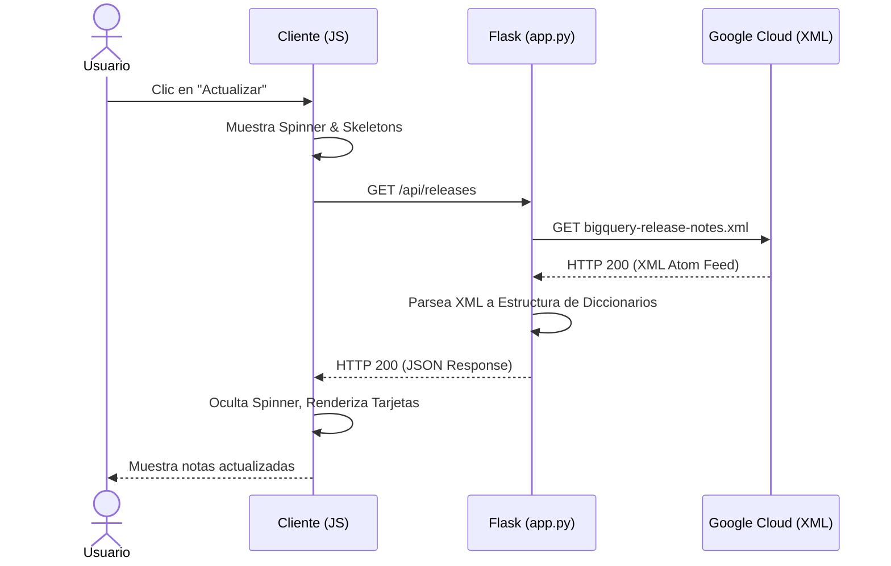

# Explicación Detallada del Proyecto: BigQuery Release Notes

Este documento proporciona un desglose completo de la arquitectura del proyecto, el flujo de datos entre el servidor y el cliente, y una explicación detallada del funcionamiento de [app.py](../app.py).

---

## 1. Funciones Principales

El sistema está diseñado como un lector asíncrono y herramienta de difusión de notas de lanzamiento. Sus funciones principales son:

*   **Ingesta del Feed Oficial:** Conexión automatizada al feed XML de Google Cloud BigQuery.
*   **Normalización de Datos:** Conversión de estructuras XML complejas (Atom) a objetos JSON legibles.
*   **Presentación Interactiva:** Interfaz responsiva con soporte de carga (skeletons) y actualización dinámica.
*   **Integración Social (Twitter/X):** Generación de tweets pre-redactados (individuales o en bloque) respetando las restricciones de longitud de la red social.

---

## 2. Desglose de Arquitectura

El proyecto está separado limpiamente en una capa de servidor (Python/Flask) y una capa de cliente (HTML/JS/CSS puro).

### Servidor (Python/Flask)
El backend actúa como un proxy inverso y procesador de datos para evitar problemas de CORS (Cross-Origin Resource Sharing) que ocurrirían si el navegador intentara leer directamente el feed de Google Cloud.

*   **Ruta Estática (`/`):** Sirve la página principal [index.html](../templates/index.html).
*   **Ruta API (`/api/releases`):** 
    1. Realiza una petición GET al feed XML.
    2. Parsea el árbol XML usando namespaces.
    3. Construye una lista normalizada con campos de fecha, título y contenido.
    4. Envía la respuesta en formato JSON.

### Cliente (HTML/JS/CSS)
El frontend gestiona la interactividad y la experiencia de usuario.

*   **Interfaz Dinámica (`script.js`):** Gestiona las peticiones Fetch, realiza las transiciones de carga mediante skeletons y renders dinámicos en el DOM.
*   **Gestor de Compartir:** Recopila las notas seleccionadas, limpia el marcado HTML para obtener texto plano, trunca la información al límite de 280 caracteres e inicia la pestaña de publicación de Twitter.
*   **Estilos y Animaciones (`style.css`):** Define el tema oscuro moderno, efectos glassmorphism en las tarjetas y la animación del spinner del botón de refresco.

---

## 3. Flujo de Petición/Respuesta de Muestra

A continuación se detalla la secuencia que se desencadena cuando el usuario hace clic en el botón **Actualizar**:



### Estructura de Datos (JSON) de la Respuesta del Servidor

La API devuelve un objeto con la estructura siguiente:

```json
{
  "releases": [
    {
      "id": "https://cloud.google.com/bigquery/docs/release-notes#June_15_2026",
      "title": "BigQuery release notes",
      "updated": "2026-06-15",
      "content": "<h3>June 15, 2026</h3><p>Se ha añadido soporte para...</p>"
    }
  ]
}
```

---

## 4. Explicación Detallada de `app.py`

El archivo [app.py](../app.py) contiene el núcleo del servidor de la aplicación. A continuación se desglosa su código sección por sección:

```python
import os
import requests
import xml.etree.ElementTree as ET
from flask import Flask, jsonify, render_template, request

app = Flask(__name__)

# Definimos los espacios de nombres del feed Atom
NAMESPACES = {'atom': 'http://www.w3.org/2005/Atom'}
```
> [!NOTE]
> *   `xml.etree.ElementTree` se utiliza para la navegación en el árbol jerárquico del archivo XML.
> *   `NAMESPACES` es crucial ya que los feeds Atom de Google Cloud emplean un esquema XML estructurado con el URI `'http://www.w3.org/2005/Atom'`. Sin mapear este namespace, las búsquedas de nodos con XPath fallarían.

### Renderizado de la Interfaz
```python
@app.route('/')
def index():
    return render_template('index.html')
```
*   Esta ruta simplemente gestiona la primera carga de la página, entregando la plantilla [index.html](../templates/index.html) que hace uso de los estáticos CSS y JS.

### Endpoint del Feed y Procesamiento XML
```python
@app.route('/api/releases')
def get_releases():
    url = "https://docs.cloud.google.com/feeds/bigquery-release-notes.xml"
    try:
        response = requests.get(url, timeout=10)
        response.raise_for_status()
    except Exception as e:
        return jsonify({"error": f"Error al descargar las notas de lanzamiento: {str(e)}"}), 500
```
> [!IMPORTANT]
> *   La descarga se realiza con un `timeout=10` para evitar hilos bloqueados eternamente si el servicio de Google estuviera caído.
> *   `response.raise_for_status()` propaga cualquier error de red (como 404 o 500) directamente al bloque `except`.

```python
    try:
        root = ET.fromstring(response.content)
        entries = []
        for entry_node in root.findall('atom:entry', NAMESPACES):
            title_node = entry_node.find('atom:title', NAMESPACES)
            id_node = entry_node.find('atom:id', NAMESPACES)
            updated_node = entry_node.find('atom:updated', NAMESPACES)
            content_node = entry_node.find('atom:content', NAMESPACES)

            title = title_node.text if title_node is not None else "Sin título"
            entry_id = id_node.text if id_node is not None else ""
            updated = updated_node.text if updated_node is not None else ""
            content = content_node.text if content_node is not None else ""
```
*   `ET.fromstring` carga el contenido binario del feed en memoria y genera un objeto jerárquico accesible.
*   `root.findall('atom:entry', NAMESPACES)` busca cada entrada de lanzamiento individual utilizando el namespace de Atom definido previamente.
*   Se extraen los nodos clave (`title`, `id`, `updated`, `content`) utilizando validaciones condicionales `if not None` para evitar excepciones por campos vacíos en el XML.

```python
            # Intentar formatear la fecha a algo más amigable si es posible
            # updated suele ser algo como: 2026-06-15T12:00:00Z
            date_str = updated
            if updated:
                try:
                    # Formato simple: YYYY-MM-DD
                    date_str = updated.split('T')[0]
                except Exception:
                    pass

            entries.append({
                "id": entry_id,
                "title": title,
                "updated": date_str,
                "content": content
            })

        return jsonify({"releases": entries})
    except Exception as e:
        return jsonify({"error": f"Error al procesar el feed de notas de lanzamiento: {str(e)}"}), 500
```
*   **Limpieza de Fecha:** El feed proporciona fechas en formato ISO-8601 completo (`YYYY-MM-DDTHH:MM:SSZ`). El script las simplifica a formato `YYYY-MM-DD` mediante una separación por el carácter `'T'`.
*   El resultado se devuelve como una lista JSON estructurada bajo la clave `releases` con código de estado HTTP 200, encapsulado en un bloque `try/except` de seguridad que reporta fallos en la estructura del XML.
